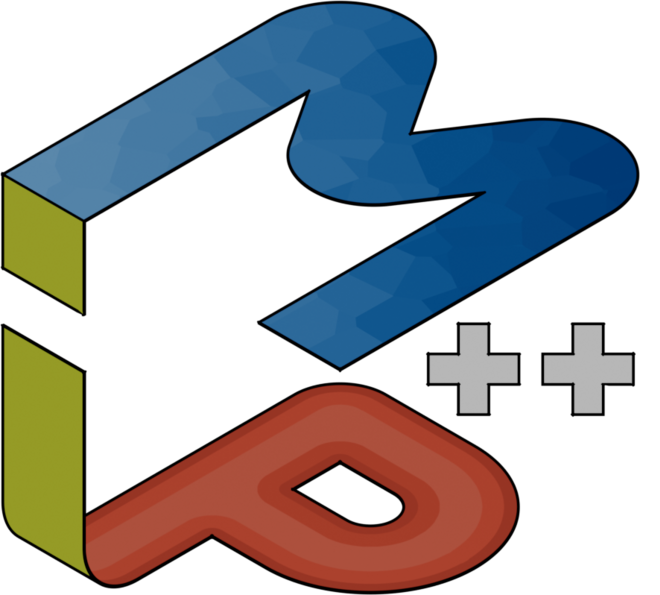

<p align="center">
  
</p>

#

**One model, any solver — at raw C API speed.**

MIP++ is a header-only C++23 library for linear, mixed-integer, and quadratic programming. It gives you an algebraic modeling syntax as readable as JuMP or Pyomo, but compiles down to direct calls into the solver's own C API — no intermediate model representation, no extraction step, no allocation in the expression layer. The same model code targets any of **11 solvers**; you choose the backend at compile time, and its shared library is discovered and loaded dynamically at runtime, with no link-time solver dependency.

📖 **[Documentation](https://fhamonic.github.io/mippp/)** — start with the [Getting Started guide](https://fhamonic.github.io/mippp/getting-started/).

[](https://en.cppreference.com/w/cpp/23)
[](https://conan.io)
[](https://www.boost.org/users/license.html)

## A first model

```cpp
#include <print>

#include "mippp/solvers/highs/all.hpp"

using namespace mippp;
using namespace mippp::operators;

int main() {
    highs_api api;        // loads the HiGHS shared library at runtime
    highs_lp model(api);  // swap for gurobi_*, cplex_*, cbc_*, ...

    auto x1 = model.add_variable();
    auto x2 = model.add_variable({.upper_bound = 3});

    model.set_maximization();
    model.set_objective(4 * x1 + 5 * x2);
    model.add_constraint(x1 <= 4);
    model.add_constraint(2 * x1 + x2 <= 9);

    model.solve();
    auto sol = model.get_solution();

    std::println("objective = {}", model.get_solution_value());
    std::println("x1 = {}, x2 = {}", sol[x1], sol[x2]);
    return 0;
}
```

The [Getting Started guide](https://fhamonic.github.io/mippp/getting-started/) walks through this model, the expression system, and solver selection. Runnable examples — N-Queens, sudoku, TSP with lazy subtour elimination, cutting stock via column generation — live in [`examples/`](examples/).


## Why MIP++

### One model, any solver

Benchmarking Gurobi vs. CPLEX vs. HiGHS vs. SCIP is a two-line change and a recompile — no `#ifdef` soup, no linking against a solver SDK. Solver shared libraries are discovered at runtime via exact path parameter, per-solver environment variables (`MIPPP_HIGHS_LIBRARY`, etc.) or `LD_LIBRARY_PATH` and system directories: a single compiled binary runs on whatever solver the machine has installed. ([Why MIP++](https://fhamonic.github.io/mippp/getting-started/))


### No modeling tax

Filling a model through MIP++ costs **99–104% of what calling the solver's own C API costs**. Against the other modeling layers, on the same backend: **2.3–7.7× faster than OR-Tools'** two C++ APIs, **4–21× faster than JuMP**, and one to two orders of magnitude faster than the Python interfaces — all measured on model construction alone, never on solving. Build time is noise for a one-shot solve that runs for hours, but can dominate in algorithms that build, modify, and re-solve constantly: column generation, Benders decomposition, cutting planes, large-scale experiments. MIP++ is built for those. [See the benchmark ↓](#performance)

The speedup comes from the expression system's architecture: objectives and constraints are composed from C++ ranges as lazy views using `xsum`, and they allocate nothing. When a constraint is added, its term range is iterated directly into the pre-allocated scratch buffers passed to the solver's C API (`Highs_addRow`, `GRBaddconstr`, etc.). There is no intermediate model representation to build, extract, or garbage-collect. ([Expressions and constraints](https://fhamonic.github.io/mippp/modeling/expressions/))


### Built for algorithms, not just models

A MIP++ model *is* the solver's native model. There is no extraction step, so re-solves after modifications (adding variables, changing bounds, adding constraints) pay only the solver's incremental update cost, never a full model rebuild.

The library exposes the algorithmic hooks that decomposition and cutting-plane methods need:

- [**Branch-and-cut callbacks**](https://fhamonic.github.io/mippp/algorithms/branch-and-cut/) with lazy constraints — the TSP example in `examples/tsp_lazy_constraints.cpp` adds subtour elimination cuts through a typed callback handle using the same `xsum` syntax as the main model.
- [**Column generation**](https://fhamonic.github.io/mippp/algorithms/column-generation/) via `add_column`, dual values (`get_dual_solution`), and reduced costs (`get_reduced_costs`). A full `column_manager` framework tracks columns across pool and master states, propagates pricing events to per-column properties (reduced cost, age, basis status) through compile-time event dispatch, and provides pluggable activation/eviction strategies — all at zero runtime overhead for unused properties.
- **MIP starts**, **SOS1/SOS2 constraints**, **indicator constraints**, and [**in-place model updates**](https://fhamonic.github.io/mippp/solving/updates/) (bound changes, coefficient changes, variable/constraint removal). When columns are evicted, solvers compact their internal arrays, invalidating external indices. MIP++ keeps user-facing variable handles stable through a bidirectional handle/native-ID map — but the map is only allocated on the first deletion; models that never remove variables pay nothing beyond a branch prediction.


### Solve statuses that survive the backend swap

Solver-agnostic code usually hides backend-specific outcomes behind a lowest-common-denominator enum. MIP++ does the opposite: each backend's `solve_status()` returns a `std::variant` whose alternatives are exactly the statuses *that solver actually reports*. MOSEK's LP variant distinguishes `primal_and_dual_infeasible` from plain `infeasible`; Clp's only carries `optimal`, `infeasible`, and `unbounded`. Nothing is erased.

Generic queries work through the status type hierarchy: `primal_and_dual_infeasible` inherits from `infeasible`, which inherits from `infeasible_or_unbounded`. Calling `is_a<status::infeasible_or_unbounded>` matches any of them — one question, every solver. Calling `is<status::primal_and_dual_infeasible>` asks the exact question instead, and will only compile if the backend can report it. This abstraction is free at runtime — the inheritance check is resolved at compile time, so the compiler reduces it to a direct index check. ([Status and limits](https://fhamonic.github.io/mippp/solving/status-and-limits/))


## Performance

Time to *build* the N-Queens model (`N²` binary variables, `6N−6` constraints) through eight modeling libraries across C++, Julia and Python. Only model construction is timed, never the resolution: the timer stops once the model holds every variable and constraint, after flushing any pending update.

### MIP++ vs. the Gurobi C API

The most direct measure of modeling overhead — the raw C API in milliseconds, MIP++ as a percentage of it, the other Gurobi-capable interfaces as multiples:

| N | Gurobi C API | MIP++ | gurobipy | JuMP direct | Python-MIP |
| ---: | ---: | ---: | ---: | ---: | ---: |
| 100 | **3.2 ms** | 99% | 6.5× | 3.7× | 19.7× |
| 500 | **46.1 ms** | 99% | 9.9× | 8.0× | 18.7× |
| 1000 | **190.2 ms** | 103% | 12.1× | 7.5× | 18.4× |

MIP++ tracks the raw C API to within a few percent across the whole sweep: the abstraction layer is essentially free. Handing Gurobi the entire matrix in one `GRBaddconstrs` call rather than one `GRBaddconstr` per constraint is worth nothing, so matching the per-constraint path is the meaningful comparison rather than a handicap.

### MIP++ vs. the other C++/Julia interfaces

MIP++ in absolute milliseconds, the other interfaces as multiples of it **on the same backend** (HiGHS, the one backend all of them support):

| N | **MIP++** | OR-Tools `MPSolver` | OR-Tools MathOpt | JuMP cached | JuMP direct |
| ---: | ---: | ---: | ---: | ---: | ---: |
| 100 | **1.5 ms** | 2.4× | 3.3× | 4.1× | 13.1× |
| 500 | **34.1 ms** | 2.6× | 5.2× | 6.8× | 16.6× |
| 1000 | **137.6 ms** | 2.8× | 7.7× | 6.5× | 21.1× |

On Cbc the gap against `MPSolver` is wider still — 4.2–5.7× across the sweep, MIP++ filling the model in 67.0 ms at N=1000.

> [!NOTE]
> The comparison is **not work-for-work, and the bias is against MIP++**. OR-Tools' two APIs and JuMP's default `Model` accumulate the model in their own structures and hand it to the solver later; MIP++, the Gurobi C API and JuMP's `direct_model` write into the solver's own model as each constraint is added. Two tells: JuMP cached fills at the same speed whichever backend is named (888 ms HiGHS, 887 ms Gurobi at N=1000), and `MPSolver` needs ~385 ms at N=1000 for Cbc, HiGHS and SCIP alike. This is also why OR-Tools appears *faster* on SCIP (58% of MIP++) — it has not handed SCIP anything yet.

Against the Python interfaces on the same backend, MIP++ is 12× faster than gurobipy, ~50× than Python-MIP, ~100× than PuLP and ~140× than highspy.

> [!WARNING]
> The Cbc figures were measured against Cbc's `devel` branch, the only version that caches `addRow`; release 2.10.13 (what `coinor-libcbc-dev` ships) flushes the matrix on every call and is substantially slower for every interface that builds directly in Cbc.

N-Queens is a variable-heavy, constraint-light model, measured on a single machine and compiler — the ratios transfer, the absolute times do not.

Full tables (N=100–1000 in steps of 100), per-backend results for seven solvers, build-variant comparisons, limitations, and reproduction instructions: [Performance](https://fhamonic.github.io/mippp/performance/) — benchmark code in [mippp_nqueens](https://github.com/fhamonic/mippp_nqueens).


## Supported solvers

| Backend | LP | MILP | QP |
| --- | :-: | :-: | :-: |
| HiGHS | ✓ | ✓ | ✓ |
| Gurobi, CPLEX, Xpress, COPT, MOSEK, GLPK | ✓ | ✓ | |
| Cbc, SCIP | | ✓ | |
| Clp, SoPlex | ✓ | | |

Per-feature support (duals, reduced costs, callbacks, MIP starts, basis access, …) varies by backend — see the feature matrices in [Choosing a solver](https://fhamonic.github.io/mippp/solvers/).


## Is MIP++ for you?

MIP++ has a deliberate niche. It is worth being honest about where it fits and where it doesn't.

### Where MIP++ fits well

**Optimization embedded in a larger C++ system.** A simulator, a planning service, a shipped binary that must run with whatever solver the user has installed. The runtime `dlopen`-based solver loading means no recompilation per solver and no link-time SDK dependency — this is the sweet spot.

**Cross-solver experiments.** Reviewers asking for results on Gurobi *and* an open solver, licenses that differ between your laptop, the cluster, and your coauthors' machines. The two-line backend switch was built for exactly this.

**Build-bound iterative methods.** Column generation, cutting planes, Benders decomposition, iterated reoptimization. In-place model updates, `add_column` with a full column pool manager, and lazy-constraint callbacks are here today.

### Where something else is a better fit

**Everyday modeling in Python or Julia.** Stay with gurobipy, JuMP, or Pyomo. They are mature, their communities are large, and for a one-shot solve where solver time dominates, the modeling overhead rarely matters.

**Heavy solver-specific parameter tuning.** The `*_api` objects expose the raw C entry points, but the model classes do not yet hand out their native solver handles. Native-handle access is on the [roadmap](#roadmap).

**Constraint programming or scheduling.** Use OR-Tools CP-SAT or a dedicated CP solver.

> [!IMPORTANT]
> MIP++ requires **GCC 14+ / C++23** (GCC 15 / C++26 recommended) and assumes comfort with modern C++ — ranges, concepts, and template diagnostics. It is a young, single-maintainer project; contributions are welcome, but pin a version if you build long-lived research code on it.


## Installation

Install via Conan or as a CMake subdirectory:

```bash
git clone https://github.com/fhamonic/mippp && cd mippp
conan create . -u -b=missing -pr=<your_conan_profile>
```

Solver shared libraries are discovered at runtime; only the solvers you actually have installed need to be present. Per-solver environment variables (`MIPPP_HIGHS_LIBRARY`, `MIPPP_GUROBI_LIBRARY`, etc.) can pin specific library paths or versioned sonames. Full instructions: [Installation](https://fhamonic.github.io/mippp/getting-started/installation/).


## Roadmap

The modeling core is in place: LP/MILP/QP, lazy-constraint callbacks, column generation with a pool manager, reduced costs, MIP starts, SOS/indicator constraints, in-place model updates, LP basis access.

Planned, roughly by priority:

| Priority | Feature | Notes |
| :---: | --- | --- |
| 🔴 | **LP basis warm-starts** | `set_basis` and the concept exist; backend wiring in progress |
| 🔴 | **User-cut callbacks** | For cutting-plane methods at node relaxations |
| 🔴 | **Heuristic-solution injection** | Injecting primal solutions from within callbacks |
| 🟠 | **Native-handle access** | Expose the solver's internal model pointer for solver-specific parameters |
| 🟠 | **QP objectives beyond HiGHS** | Extend Hessian support to Gurobi, CPLEX, MOSEK, etc. |
| 🟡 | **QCP/SOCP constraints** | Quadratically constrained programs |
| 🟡 | **Model file I/O** | Read/write LP and MPS files |
| 🟡 | **Infeasibility diagnosis (IIS)** | Irreducible infeasible subsystem extraction |
| ⚪ | Solution pools, multi-objective, semi-continuous variables, logging control, progress getters | |

> [!NOTE]
> Since a MIP++ model *is* the solver's native model, re-solves after in-place modifications (adding rows, changing bounds) almost always warm-start from the last basis implicitly. The roadmap item above is about explicit basis get/set — transferring a basis between models or storing one for later.

The first three items are what build-bound, re-solve-heavy research code wants most. Until they land, a column-generation or cutting-plane study hitting those specific features may still be better served by a direct solver API — and the honest comparison is in the [Is MIP++ for you?](#is-mip-for-you) section above.

Contributions are welcome — see [CONTRIBUTING.md](CONTRIBUTING.md), and open an issue to claim an item.


## Acknowledgements

This work is grounded in the PhD thesis and postdoctoral positions of François Hamonic, funded by Région Sud and Natural Solutions (PhD grant), the ERC project SCALED (grant n°949812), the PEPR VDBI project RESILIENCE, and the OASIS project of Aix-Marseille University's ITEM institute (postdoctoral positions).


## Documentation, citing, license

- 📖 Documentation: [fhamonic.github.io/mippp](https://fhamonic.github.io/mippp/) — sources live under [`docs/`](docs/).
- 📄 If you use MIP++ in academic work, please cite it — see [`CITATION.cff`](CITATION.cff).
- ⚖️ Licensed under the [Boost Software License 1.0](LICENSE.md).
